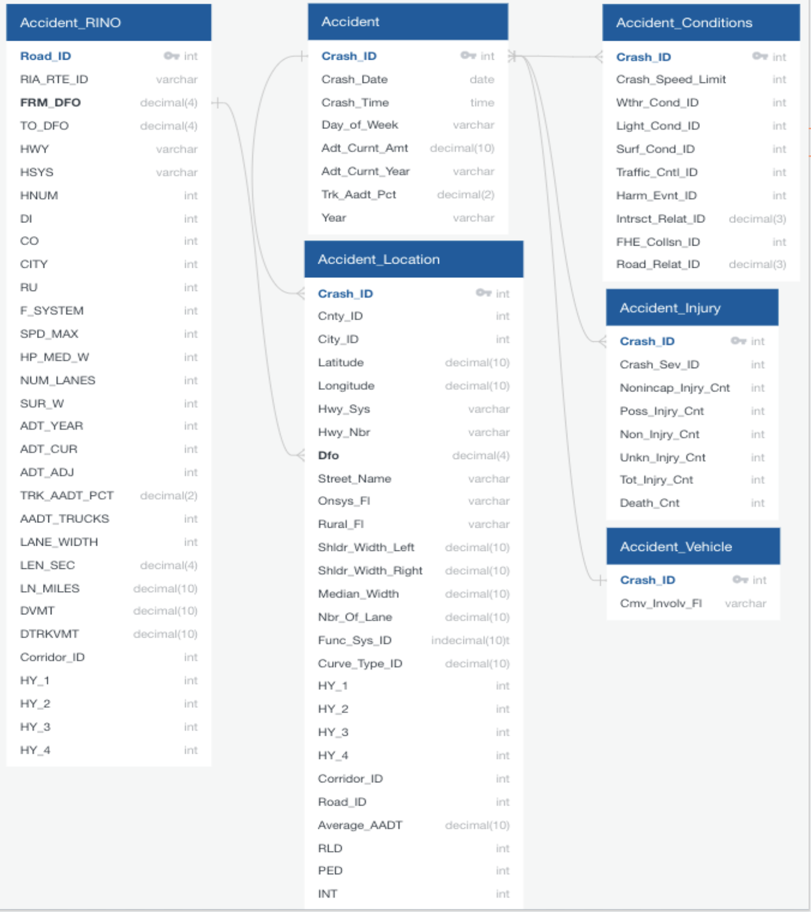
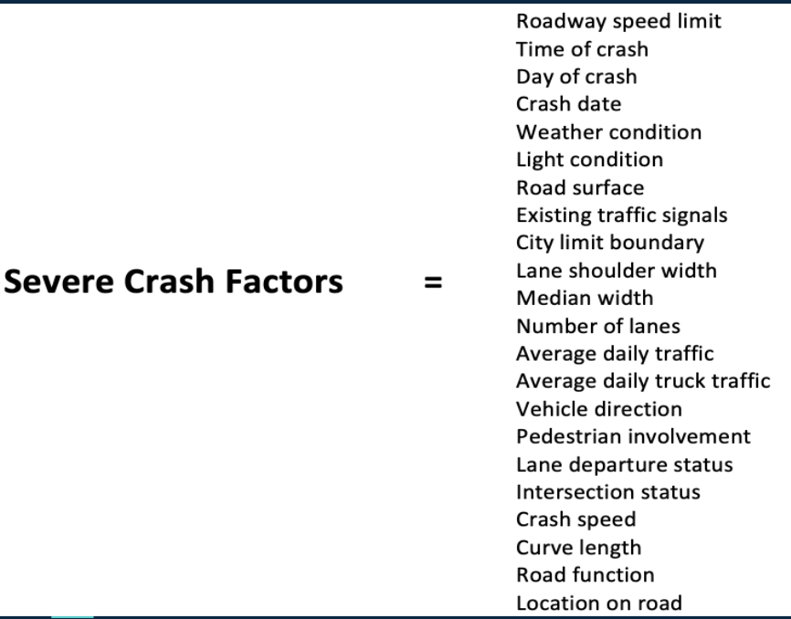
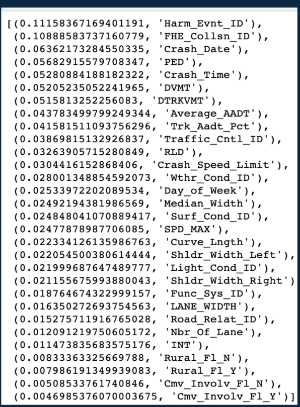
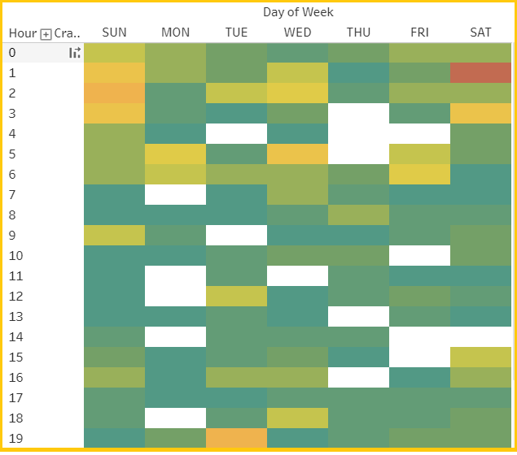

# Predictive_Crash_Analysis 

## Introducing the Team

- Dylan Kurth
- Houssam Ghandour
- Jason Ramirez
- Sean Phan

## Link to Presentation Slides 

- https://docs.google.com/presentation/d/15xzNxXrcW3W_DVtDcuPw3wsibmkmomp2nanFLIcRt20/edit?usp=sharing

## Link to Dashboard

- https://public.tableau.com/profile/houssam.ghandour#!/vizhome/TravisCountyCrashAnalysis/TravisCountyCrashAnalysis?publish=yes

# Overview 

The purpose of this project is to predict the crash severity based on a roadway and traffic risk factors. Our team decided to use Python, SQL Database, and  balanced random forest and Ensemble Adapative Boosting machine learning approaches to analyze the data. The visualizations are represented using Tableau. 

## Purpose

Our team seeks to improve the safety of Travis County roadways by using the data collected to identify crash patterns and the risk factors associated with crash severity.

## Data Sources

- The crash data is pulled from the Texas Department of Transportation Crash Records Information System (CRIS).
- The crash data was downloaded from the years 2015-2020.
- The Roadway Inventory Data was downloaded from the Texas Department of Transportation Open GIS Records. 

## Questions we want to answer

- Can we predict the severity of a collision based on road and traffic risk factors?

- What risk factors lead to more severe crashes?

- With more traffic and crashes, do we expect more or less severe crashes?

## Technologies 

- Data Cleaning and Analysis: For the data cleaning and analysis we used Python (Pandas, NumPy, Sklearn).

- Database Storage: The database was hosted on Postgres, and is integrated on Tableau to visualize our data.

- Machine Learning: We utilized the Python machine learning library Sklearn to create a model. 

- Dashboard: We hosted our dashboard using Tableau Public.

# Database Storage

- For the database we used PostgresSQL and SQLAlchemy to connect the database for storing the crash and roadway data.

- Connected Database to the Machine Learning Model: Project data collection and clean up has been completed. Final data are in .csv format.

- The Entity Relationship Diagram image below shows the variables chosen for further analysis.

# Exploratory Analysis

- Revised and selected variables based on correlation & relevancy compared with the crash severity data.

- The relationships between features was reviewed, with the correlation matrix listed below.  

# Machine Learning

## Model Choice

The goal of the project model is to predict whether a crash in Travis County, Texas, will result in an incapacitating injury. As such, injuries sustained (and documented in the crash data set) will be categorized as one of two groups, incapacitating and not incapacitating. 

The initial analysis choice was logistic regression, a model based on the sigmoid curve that produces a probability (between 0 and 1) of the input data belonging to a group based on a combination of explanatory variables. Although logistic regression seemed a natural choice for the project because of its ease of dissection and interpretation, the output did not yield the desired results, and in particular did not delineate between predicted and observed outcomes.

After testing several options (AdaBoost Classifier, Naive Random Oversampling, Condition Sampling), one classifying approach proved a better choice for predicting severe crash likelihood: an ensemble learning algorithm called a random forest model. The random forest model takes samples of data and combines the resulting decision trees to develop a stronger predictor. This approach has several benefits, among them fewer issues with overfitting and variable importance ranking. The model proved more functional with more understandable and defensible results.      

Note it is possible that based on the number of data points and features in the source data set that a more complex model like a neural network may be more useful. Arguably the neural network will not be overwhelmed by a data set with thousands of data points and dozens of features, as the logistic regression model may have been. Given more time, this approach may be employed in the future.  

## Preprocessing

For the random forest model analyzing the severity of crash data, Python Pandas preprocessing consisted of creating dummy variables, recoding dates and times to numeric fields, recoding missing data, and encoding categorical variables. Specifically:  

* A data field indicating crash incidents outside of city limits was changed to reads 1/0 instead of Y/N.
* Categorical data fields were change to numeric values, such as using custom coding to recode, and to maintain the order of, crash days of the week. The Scikit-learn label encoder transformed variables without expected sequence like crash highway numbers.  
* The Pandas datetime function was applied to the dates and times of crashes. 
* The data set as received coded, for most variables, unknown values as 0. For example, an unknown road speed limit read 0 if unknown. The NumPy library was used to change data points in this group showing 0 to missing. 
* Given the scope of the project and data, the output – a measure of the severity of crashes – was recoded to binary form (1, 0) from 5 options. Severity categories of 1, 2, and 4 were labeled incapacitating (1) and severity categories 3 and 5 not-incapacitating (0).     

Finally, scaling techniques were applied to explanatory features to account for wide-ranging numerical values. Scaling adjusts the feature values so that the mean of each is 0 and accompanying standard deviation is 1.

## Feature Processing

The source data set had few cases for which variable information was missing. As such, rows with missing data were removed from initial prediction attempts. Relatedly, the source data also included several fields with missing data, which were removed from the model.  

Controlling for missing data, 29 variables that may influence the severity of a crash were analyzed. Variables were chosen based participant experience working with these data. In addition, the data are from an established and well used data set, suggesting validity. The features were as follows: roadway speed limit, time of crash, day of crash, crash date, weather condition, light condition, road surface, existing traffic signals, city limit boundary, lane shoulder width, median width, number of lanes, average daily traffic, average daily truck traffic, vehicle direction, pedestrian involvement, lane departure status, intersection status, crash speed, curve length, road function, and location on road.

The image show below are the severe crash variables that we narrowed down as most relevant for the machine learning models. 

 
## Model Results

To help determine the effectiveness of the model, the source data was split into training and testing datasets. The training data sets allow the model to learn about the data, whereas the testing data sets assess the performance of the training.   

The Python Pandas Scikit-learn train_test_split module was employed to split the data, namely to create (a) training data sets consisting of explanatory and outcome variables, and (b) testing data sets consisting of explanatory and outcome variables. In this process, specific cases were assigned to specific data sets – based on coded instruction – so that the model could be replicated consistently. In addition, the data sets were stratified. This process ensured that when the data were split, similar proportions belonged to each group so that results will not be skewed toward the training or testing sides. The Scikit-learn library was also used to define and train the model. 

Based on a comparison of actual vs predicted severe crashes, the modele yielded an accuracy score of .65, or 65 percent. In addition, the random forest model forest provided a feature importance score as shown below.

One of our visualizations in the dashboard shown below confirms the relevancy of crash time and crash date variables related to crash severity. It can be shown that most severe crashes during early morning hours, especially on the weekends where parties and alcohol might be of influence. 

# Recommandations

- Capture more variables potentially from census (income group, car information)

- Try other machine learning models (e.g., Neural Network) to achieve better results

- Predict fatal crashes rather than all severe crashes

